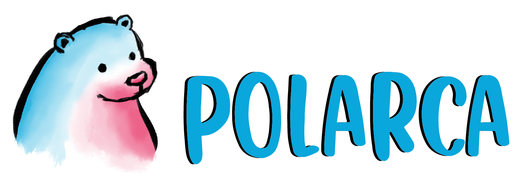

# polarca is a good way to interpolate anything in game maker studio 2 🐻‍❄️

### The usage is pretty simple. Basically we have 1 struct and two methods to explore

 

	
struct polarca_animation

     
## that struct stores all the important information about our animation
     /// @param _attribute -> name of the attribute you like do change
     /// @param _value -> Value that you want to attribute reach
     /// @param _animcurv -> animation curve that controller should use
     /// @param _channel_index -> channel index from animation curve that controller should use 
     /// @param _curve_speed -> animation speed

     polarca_animation(_attribute,_value, _animcurv, _channel_index, _curve_speed)

	
function polarca_animation_start

     
## creates a controller that does the interpolation for you

     /// @param _arr -> an array of Animations

     polarca_animation_start(_arr)

	
function polarca_sequence_start

     
## creates a controller that does sequential interpolations for you using multiples controllers.
     /// @param _arr -> an array of an array of Animations

     polarca_sequence_start(_arr)

